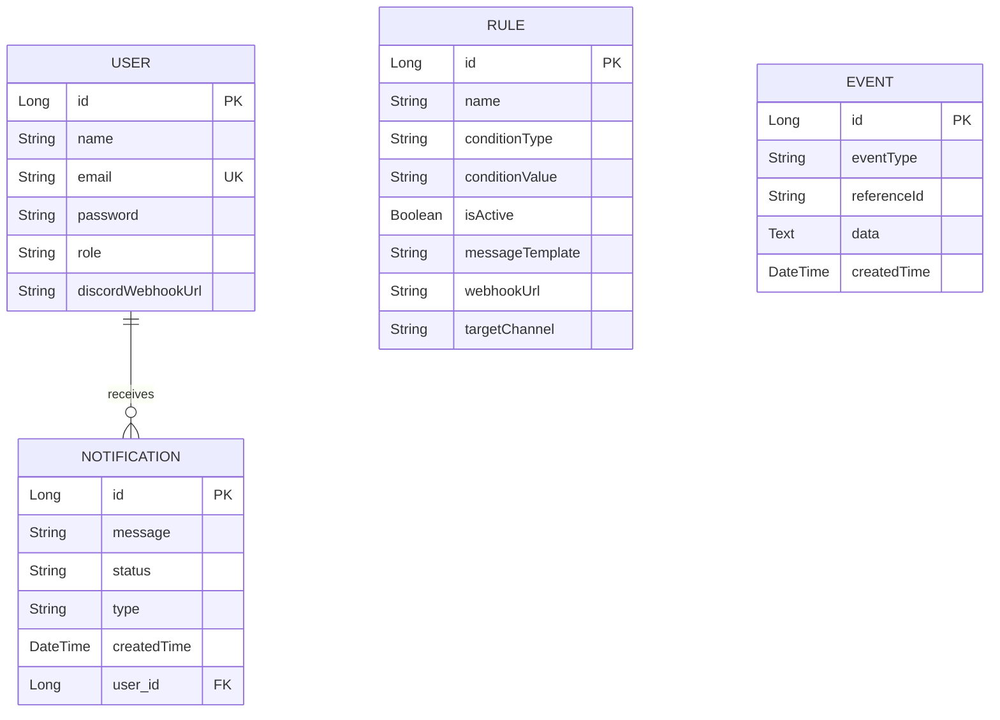
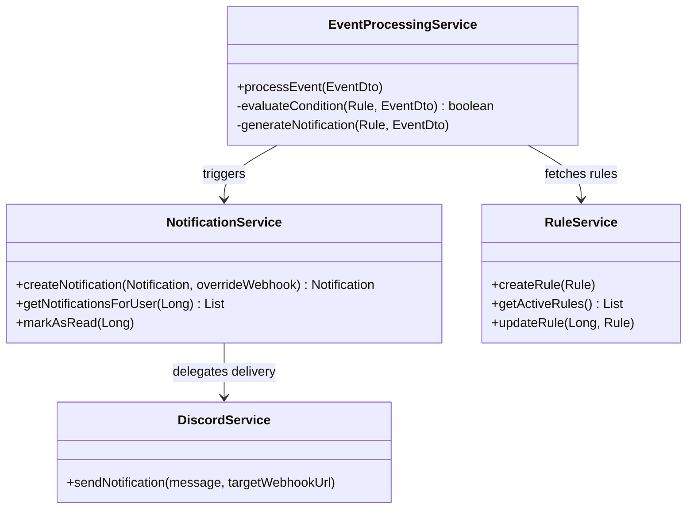
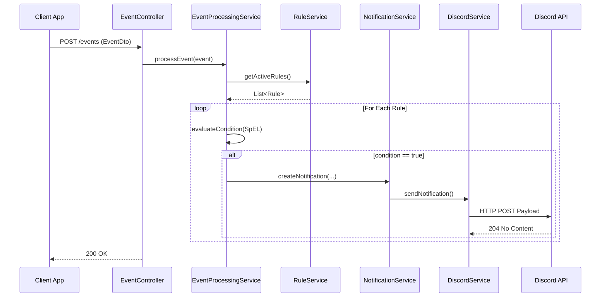
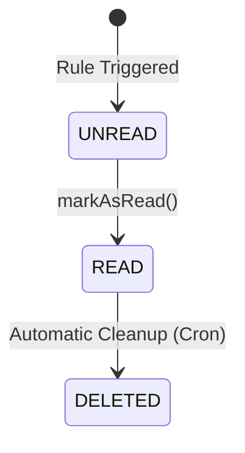

---
pdf_options:
  format: A4
  margin: 20mm
  printBackground: true
---

<div style="text-align: center; margin-top: 100px;">
  <h1>SMART NOTIFICATION SYSTEM</h1>
  <h2>A Real-Time Middleware for Event Processing and Multi-Channel Routing</h2>
  <br><br><br><br>
  <h3>Major Project Report</h3>
  <br><br>
  <p><strong>Submitted by:</strong> Sanskriti Singh</p>
  <p><strong>Organization:</strong> EchoBrain Pvt. Ltd.</p>
  <p><strong>Date:</strong> May 2026</p>
</div>

<div style="page-break-after: always;"></div>

## Table of Contents
1. [Abstract](#1-abstract)
2. [Introduction](#2-introduction)
3. [Problem Statement & Proposed Solution](#3-problem-statement--proposed-solution)
4. [Technology Stack](#4-technology-stack)
5. [System Architecture & Design](#5-system-architecture--design)
   - 5.1 Use Case Diagram
   - 5.2 Entity-Relationship (ER) Diagram
   - 5.3 Class Diagram
   - 5.4 Sequence Diagram
   - 5.5 State Diagram
6. [Component Design & Implementation Details](#6-component-design--implementation-details)
7. [API Specification](#7-api-specification)
8. [Security Implementation](#8-security-implementation)
9. [Deployment Architecture](#9-deployment-architecture)
10. [Challenges Faced & Solutions](#10-challenges-faced--solutions)
11. [Future Scope](#11-future-scope)
12. [Conclusion](#12-conclusion)

<div style="page-break-after: always;"></div>

## 1. Abstract
The **Smart Notification System** is a robust, production-grade middleware application designed to decouple notification logic from core business services. Built using Java, Spring Boot, WebSockets, and Discord Webhooks, it serves as a centralized engine capable of receiving raw system events, evaluating them against dynamic SpEL (Spring Expression Language) rules, and routing customized alerts to distinct destinations. The system features a real-time analytics dashboard powered by Chart.js and STOMP over SockJS, ensuring immediate visualization of alert trends without polling.

## 2. Introduction
In modern microservices and enterprise architectures, multiple independent services often need to trigger notifications for various reasons—such as successful purchases, security breaches, or server downtime. Historically, notification logic was hardcoded into each specific service, leading to high maintenance costs and difficulties when attempting to change routing logic or delivery channels.

The Smart Notification System was developed during an internship at EchoBrain Pvt. Ltd. to address this challenge. It provides an independent, scalable REST API where applications simply drop "Event" payloads. The middleware takes over the responsibility of evaluating if the event warrants an alert, parsing dynamic message templates, and delivering the alert via a 3-tier routing hierarchy.

## 3. Problem Statement & Proposed Solution

### 3.1 Problem Statement
- **Scattered Logic:** Hardcoding alerting rules inside individual applications makes the system rigid.
- **Channel Limitations:** Changing the destination of an alert (e.g., from a 'General' channel to a 'Security' channel) required code changes and redeployments.
- **Lack of Visibility:** System administrators lacked a centralized view to monitor which alerts were firing most frequently.

### 3.2 Proposed Solution
A standalone Spring Boot application that acts as an intelligent router.
- **Rule Engine:** Administrators can configure rules dynamically from a web interface.
- **Real-Time Feed:** A live, WebSocket-powered feed displays notifications as they occur.
- **Multi-Tier Routing:** Webhooks are prioritized: `Rule Webhook -> User Webhook -> Global Fallback`.

<div style="page-break-after: always;"></div>

## 4. Technology Stack

| Component | Technology | Justification |
| :--- | :--- | :--- |
| **Backend Framework** | Spring Boot 3.2 (Java 17) | Provides enterprise-grade auto-configuration, dependency injection, and security out-of-the-box. |
| **Database** | MySQL 8.0 & Hibernate | Relational ACID compliance is essential for storing user data, rule configurations, and historical logs. |
| **Rule Engine** | SpEL (Spring Expression Language) | Native to Spring, allowing string-based dynamic evaluation of complex event conditions. |
| **Real-Time Comm.** | STOMP & SockJS (WebSockets) | Eliminates costly HTTP polling by pushing alerts to the client dashboard instantly. |
| **Delivery Channel** | Discord Webhooks | Supports rich embeds, markdown, and instantaneous delivery without complex third-party SDKs. |
| **Frontend** | Vanilla JS, HTML, CSS | A lightweight glassmorphism UI paired with Chart.js for zero-overhead, responsive performance. |

<div style="page-break-after: always;"></div>

## 5. System Architecture & Design

### 5.1 Use Case Diagram
This diagram outlines the core actors (Admin, System Engine) and their interactions with the system.

```mermaid
usecaseDiagram
    actor Admin
    actor SystemEngine
    
    package "Smart Notification System" {
        usecase "Login & Authenticate" as UC1
        usecase "Manage Rules (CRUD)" as UC2
        usecase "View Real-Time Dashboard" as UC3
        usecase "Configure Personal Webhook" as UC4
        
        usecase "Submit Event Payload" as UC5
        usecase "Evaluate SpEL Rules" as UC6
        usecase "Dispatch Discord Webhook" as UC7
        usecase "Broadcast via WebSocket" as UC8
    }
    
    Admin --> UC1
    Admin --> UC2
    Admin --> UC3
    Admin --> UC4
    
    SystemEngine --> UC5
    UC5 --> UC6
    UC6 --> UC7
    UC6 --> UC8
```

### 5.2 Entity-Relationship (ER) Diagram
The database schema involves Users, Rules, Events, and Notifications.



<div style="page-break-after: always;"></div>

### 5.3 Class Diagram (Core Backend Services)
The MVC-based separation of concerns in the Spring Boot backend.



### 5.4 Sequence Diagram: Event Processing Flow
The lifecycle of an incoming event, from the REST controller to Discord delivery.



### 5.5 State Diagram: Notification Lifecycle



<div style="page-break-after: always;"></div>

## 6. Component Design & Implementation Details

### 6.1 SpEL Rule Evaluation Engine
At the core of the system is the `EventProcessingService`. It dynamically evaluates logical conditions passed as strings (e.g., `#amount > 5000`).

```java
// Snippet: SpEL Evaluation Logic
ExpressionParser parser = new SpelExpressionParser();
Expression exp = parser.parseExpression(rule.getConditionValue());
StandardEvaluationContext context = new StandardEvaluationContext();

// Map event JSON data to SpEL variables
if (eventDto.getData() != null) {
    for (Map.Entry<String, Object> entry : eventDto.getData().entrySet()) {
        context.setVariable(entry.getKey(), entry.getValue());
    }
}

Boolean result = exp.getValue(context, Boolean.class);
return Boolean.TRUE.equals(result);
```

### 6.2 Three-Tier Webhook Routing
To ensure alerts reach the exact desired channel, the `DiscordService` utilizes a prioritized routing mechanism.
1. **Rule Level**: If a rule specifies a target channel (e.g., `#security-alerts`), it overrides everything.
2. **User Level**: If no rule channel exists, it checks if the target User has a personal webhook defined.
3. **Global Level**: If all else fails, the alert is sent to a global configuration defined in `application.properties`.

### 6.3 Real-Time WebSocket Broadcasting
When a notification is saved to the database, it is simultaneously broadcasted over STOMP so the admin dashboard UI updates without a page refresh.

```java
// Snippet: WebSocket Broadcasting
if (notification.getUser() != null) {
    String topic = "/topic/notifications/" + notification.getUser().getId();
    messagingTemplate.convertAndSend(topic, savedNotification);
}
```

<div style="page-break-after: always;"></div>

## 7. API Specification

| Endpoint | Method | Role | Description |
| :--- | :---: | :---: | :--- |
| `/login` | POST | Public | Authenticates a user and returns their profile. |
| `/events` | POST | Public | Entry point for triggering an event from an external app. |
| `/rules` | POST | ADMIN | Creates a new routing rule. |
| `/rules/{id}` | PUT | ADMIN | Modifies an existing rule condition or target channel. |
| `/notifications` | GET | ADMIN | Fetches all historical notifications. |
| `/analytics/stats` | GET | ADMIN | Returns aggregated counts by event type for Chart.js. |
| `/users/{id}/webhook` | PUT | USER | Updates a user's personal Discord routing URL. |

## 8. Security Implementation

- **BCrypt Hashing**: Passwords are mathematically hashed using BCrypt via Spring Security.
- **Role-Based Access Control (RBAC)**: Endpoints such as `/rules` and global `/notifications` are strictly protected by `hasRole("ADMIN")`.
- **Custom Authentication Entry Point**: Instead of interrupting the frontend Single Page Application (SPA) with an HTTP Basic login popup, a custom entry point intercepts 401 Unauthorized errors and returns clean JSON.
- **Data Privacy**: The `@JsonIgnore` annotation ensures the hashed password is never inadvertently leaked during JSON serialization in API responses.

<div style="page-break-after: always;"></div>

## 9. Deployment Architecture

The application is deployed securely utilizing Cloud technologies:
1. **Containerization (Docker)**: A multi-stage `Dockerfile` handles building via Maven (Stage 1) and executing on a lightweight Alpine JRE image (Stage 2).
2. **Database (Aiven Cloud)**: A managed MySQL 8.0 instance hosted on Google Cloud infrastructure.
3. **Hosting (Render)**: The Spring Boot Docker container is hosted on Render's platform, integrated directly with GitHub for automatic CI/CD redeployments upon pushes to the `master` branch.
4. **Secret Management**: All sensitive data (database passwords, webhook URLs) are externalized via environment variables (e.g., `${DB_PASSWORD:default}`).

## 10. Challenges Faced & Solutions

**Challenge 1: Conflicting IDs for Admins and Users**
Initially, the database utilized separate `Admin` and `User` tables. This caused Spring Security collisions where Admin ID 1 and User ID 1 were indistinguishable during authorization.
*Solution:* Merged the tables into a single `users` entity containing a `role` column (`ROLE_ADMIN` vs `ROLE_USER`). Removed all dead legacy Admin code.

**Challenge 2: Dashboard UI Flickering**
Using HTTP Polling every 5 seconds caused the DOM to completely reconstruct, leading to heavy network usage and screen flickering.
*Solution:* Migrated the architecture to WebSocket (STOMP). Now, data is only pushed when an event occurs, and JavaScript dynamically injects elements into the DOM without a full re-render.

## 11. Future Scope
- **Kafka Integration**: Transitioning the event ingestion from synchronous HTTP REST to asynchronous Apache Kafka for handling millions of events per second.
- **Multi-Platform Delivery**: Expanding the `DiscordService` into a `DeliveryService` interface that supports Slack, Microsoft Teams, and SMS (via Twilio).
- **Rate Limiting**: Implementing a token-bucket algorithm per user to prevent notification spamming.

## 12. Conclusion
The Smart Notification System successfully establishes an independent, centralized alerting infrastructure. By leveraging Spring Boot's robust ecosystem, the application achieves high maintainability and security. The integration of WebSockets ensures an engaging, real-time administrative experience, while the rule-based SpEL engine proves that complex business logic can be decoupled elegantly from core application code. The system is entirely production-ready and currently live on the internet.
